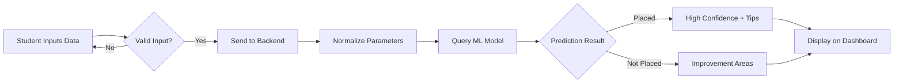
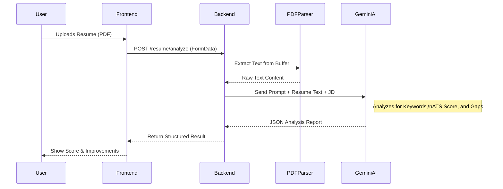

# College Community Platform - Presentation Content

## Slide 1: Title Slide
**Title:** College Community Platform
**Subtitle:** A Unified Ecosystem for Student Success & Campus Connectivity
**Presented by:** [Your Name/Team Name]

---

## Slide 2: Abstract
The **College Community Platform** is an integrated web-based solution designed to bridge the gap between students, faculty, and placement cells. In the current educational landscape, resources and communication are often fragmented across multiple channels. This project unifies these aspects into a single dashboard featuring real-time communication, academic resources, and AI-driven placement support. Key modules include a **Placement Predictor** utilizing machine learning, an AI-powered **Resume Analyzer**, and comprehensive **Skill Assessment Tests**. The platform aims to enhance student employability and streamline campus operations.

---

## Slide 3: Introduction
*   **What is it?** A comprehensive web application tailored for educational institutions.
*   **Core Philosophy:** "Connect, Learn, Grow."
*   **Key Features:**
    *   **Academic Hub:** Notices, Events, and Study Materials.
    *   **Career Focus:** Placement Prediction, Resume Analysis, and Skill Tests.
    *   **Collaboration:** Real-time Chat and Community interaction.
*   **Target Audience:** Students, Faculty, and Admin/Placement Officers.

---

## Slide 4: Problem Statement
1.  **Fragmentation:** Information (notices, materials, placement news) is scattered across WhatsApp, emails, and notice boards.
2.  **Lack of Personalized Guidance:** Students often lack immediate feedback on their employability or resume quality.
3.  **Placement Anxiety:** Uncertainty about placement chances due to a lack of data-driven insights.
4.  **Inefficient Communication:** Traditional methods of communication between students and faculty are often slow or informal.

---

## Slide 5: Objectives of the Work
1.  **Centralization:** To create a single-stop portal for all academic and non-academic activities.
2.  **Employability Enhancement:** To provide tools (Predictor, Skill Tests) that directly help students prepare for recruitment.
3.  **Data-Driven Insights:** To use historical data and ML to give students a realistic picture of their placement standing.
4.  **Automation:** To automate resume screening and basic skill assessment to save faculty time.

---

## Slide 6: Proposed Methodology
The project follows a **Modern Web Application Architecture**:
*   **Frontend-First Design:** A responsive, interactive UI built with React to ensure accessibility across devices.
*   **Microservices-Ready:** The ML prediction service operates independently, allowing for scalability.
*   **Secure Authentication:** Role-based access control (Student vs. Admin) using JWT (JSON Web Tokens).
*   **Real-time Capabilities:** deeply integrated Socket.io for instant messaging and locations.

### System Architecture Diagram
```mermaid
graph TD
    subgraph Client [Frontend (React + Vite)]
        Auth[Auth Context]
        Dash[Dashboard UI]
        ChatUI[Chat Interface]
        PredictorUI[Placement Form]
        ResumeUI[Resume Analyzer]
    end

    subgraph Server [Backend (Node.js + Express)]
        API[REST API Routes]
        Socket[Socket.io Server]
        Middleware[Auth Middleware]
        Parser[PDF Parser Service]
    end

    subgraph Database [Data Storage (MongoDB)]
        Users[(User Collection)]
        Messages[(Chat History)]
        Notices[(Notices & Events)]
        TestScores[(Student Scores)]
    end

    subgraph External [External Services]
        Gemini[Google Gemini AI]
        MLStart[ML Prediction Service]
    end

    %% Connections
    Client <-->|REST API / JSON| Server
    Client <-->|WebSocket| Socket
    Server <--> Database
    Server -->|Resume Text| Gemini
    Server -->|Student Data| MLStart
    Gemini -->|Analysis Result| Server
    MLStart -->|Prediction| Server
```

---

## Slide 7: Methods (Tech Stack)
*   **Frontend:**
    *   **Framework:** React.js (Vite) with TypeScript.
    *   **Styling:** TailwindCSS for modern, responsive design.
    *   **Icons/UI:** Lucide React.
*   **Backend:**
    *   **Runtime:** Node.js.
    *   **Framework:** Express.js (REST API architecture).
*   **Database:**
    *   **MongoDB:** NoSQL database for flexible storage of user profiles, chats, and notices.
*   **AI & Tools:**
    *   **Google Gemini API:** For intelligent Resume Analysis.
    *   **Python/Flask (External Service):** For hosting the ML Prediction Model.

---

## Slide 8: Algorithms Used in the Project
### 1. Placement Prediction Model
*   **Algorithm:** **Random Forest Classifier** (or Logistic Regression).
*   **Input Features:** Branch, CGPA, Backlogs, DSA Score, Internship History, Communication Score.
*   **Output:** Probability of placement (Placed/Not Placed) + Confidence Score.
*   **Why this algorithm?** Handles non-linear relationships well and is robust against overfitting on tabular student data.

### 2. Resume Capability Analysis
*   **Technique:** **Large Language Model (LLM) Integration via Google Gemini.**
*   **Process:**
    *   Text Extraction (using `pdf-parse`).
    *   Contextual Matching: Compares extracted resume text against standard industry keywords and job descriptions.
    *   Sentiment/Gap Analysis: Identifies missing skills and formatting errors.

### 3. Skill Assessment Scoring
*   **Logic:** Rule-based evaluation with weighted scoring.
    *   **DSA:** Checks correctness of logic (accuracy).
    *   **Communication:** MCQ-based grammar and situational checks.

### Placement Prediction Workflow


### Resume Analysis Process


---

## Slide 9: Sustainable Development Goals (SDG) Mapped
*   **SDG 4: Quality Education**
    *   *Target 4.4:* Substantially increase the number of youth and adults who have relevant skills for employment, decent jobs, and entrepreneurship.
    *   *Implementation:* Access to study materials (`Materials` page) and Skill Tests.
*   **SDG 8: Decent Work and Economic Growth**
    *   *Target 8.6:* Substantially reduce the proportion of youth not in employment, education, or training.
    *   *Implementation:* The Placement Predictor and Resume Analyzer directly target employability.

---

## Slide 10: Project Management and Finance
### Project Management
*   **Methodology:** Agile / Scrum (Iterative development).
*   **Version Control:** GitHub (Feature branching workflow).
*   **Task Tracking:** Trello / GitHub Projects.

### Finance (Zero-Cost / Low-Cost Model)
*   **Hosting:**
    *   Frontend: Vercel (Free Tier).
    *   Backend: Render/Railway (Free Tier).
*   **Database:** MongoDB Atlas (M0 Sandbox - Free).
*   **APIs:** Google Gemini (Free Tier usage).
*   **Estimated Cost:** $0 (Bootstrap phase).

---

## Slide 11: Expected Outcomes
1.  **Improved Placement Rates:** Students identify weak areas early (e.g., low DSA score) and improve before actual interviews.
2.  **Better Resume Quality:** Automated feedback leads to ATS-compliant resumes.
3.  **Streamlined Operations:** Reduced administrative burden on faculty for circulating notices and materials.
4.  **Enhanced Connectivity:** A tighter-knit college community through the Chat and Events features.

---

## Slide 12: References
1.  *[1]* S. Kumar et al., "Student Placement Prediction using Machine Learning," *2023 IEEE International Conference on Computing*, pp. 102-106.
2.  *[2]* "MERN Stack Web Development," *O'Reilly Media*, 2022.
3.  *[3]* "The Future of Education: AI in the Classroom," *UNESCO Report*, 2024.
4.  *[4]* Official Documentation: React.js, MongoDB, Google Generative AI.
